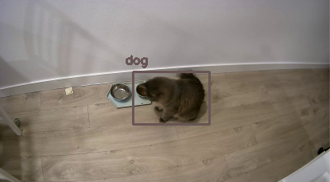
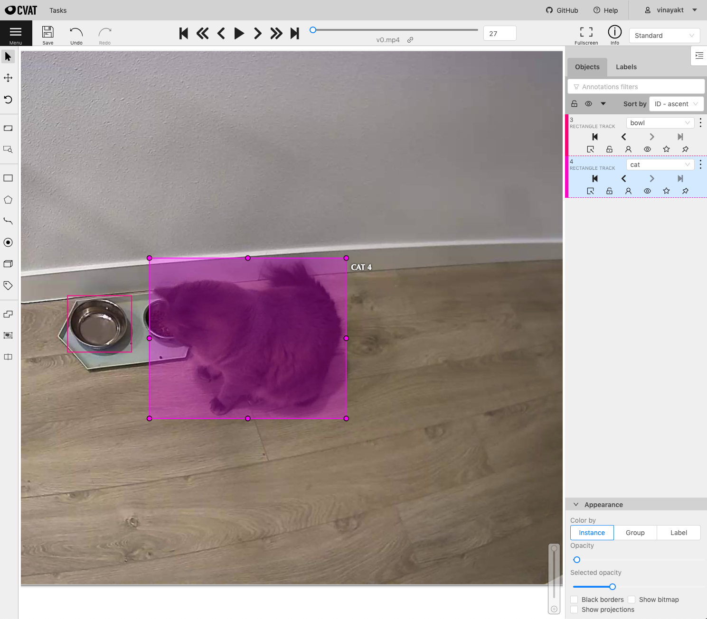
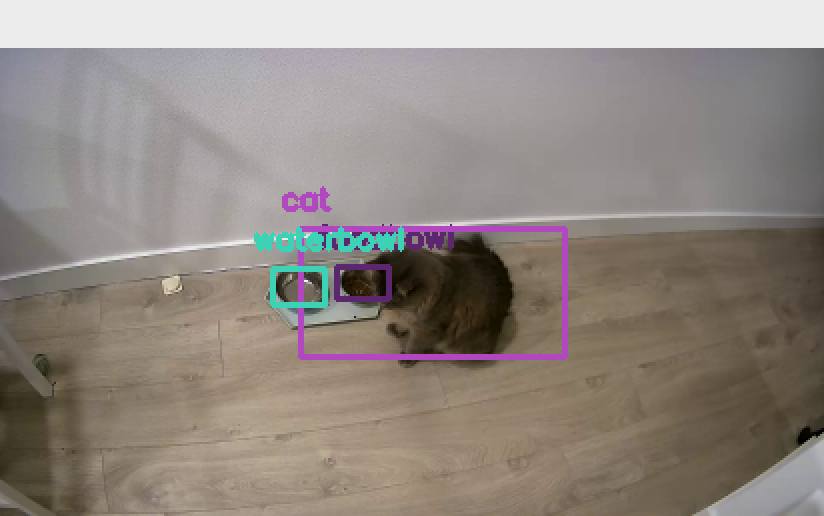
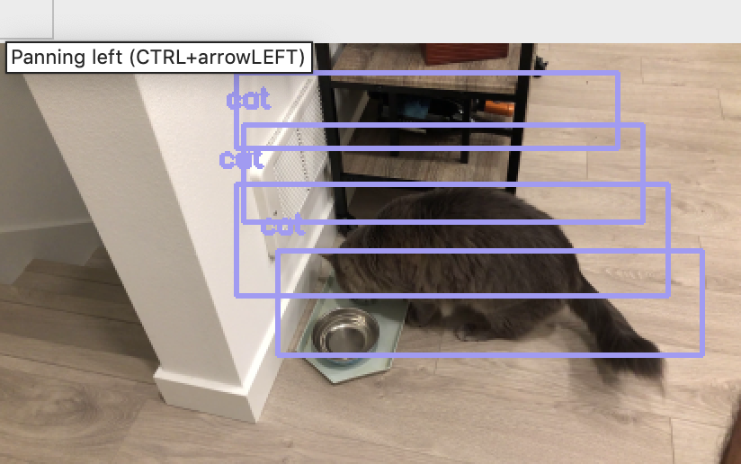
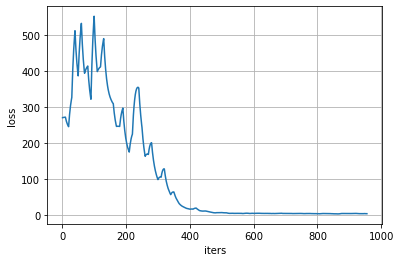
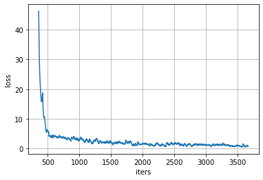
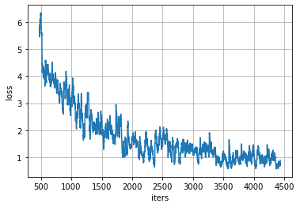
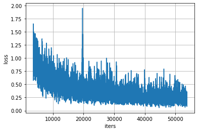
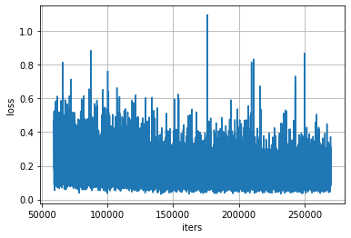
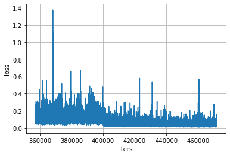

## Development Notes ##

*Documenting the development process for [UW CSEP 590C](https://docs.google.com/document/d/e/2PACX-1vRVecewhTEhIVcXXOf0iD0Okkm-DvgcBj7nHQFPgN9v1kbQ7gCkCn-VUE4Lz-p36pml0wIIQmI3begD/pub) review.*

### Project goal ###
* Given a continuous video feed of a cat's feeding area, this application should be able to 
detect when a cat ate food
* It will log the time and screenshots of the time when these times are detected
* The project isn't intended to be replicated in very different environments. Given the short amount of
time spent on this, the model training effort was just enough to make it work in my home's environment   

### Detection approach ###

Here is my crude approach to detect if a cat is eating.
 
The cat is eating if for a certain amount of time:
1. there is an overlap between the bounding boxes for the cat and foodbowl
1. there was a foodbowl that is now hidden

Tuning thresholds for how long the bowl is overlapped or hidden can help deal with model errors in some frames, 
and for situation like the cat just walking across the bowl. There is a still a big missing case where if
the cat is sitting in front of the food bowl for long, we will treat it as eating. This is unsolved right now. The downstream
application (app?) can have a validation mechanism to flag these cases which can then be used for 
training again.

I started with [YOLOv3](https://pjreddie.com/media/files/papers/YOLOv3.pdf) that was pre-trained on [COCO](http://cocodataset.org/#home). 
Based on the mechanism to detect eating, I needed to detect a cat foodbowl.
This required adding a new entity type to the pre-trained YOLO model. Because adding a new
type required modifying the network structure, I replaced all existing labels with the 3 that 
this program required: cat, foodbowl, waterbowl. 

### v0.1 (initial testing) ###
I considered using 2 separate models in parallel: the pretrained YOLO model that already detects cats,
a second custom model that would detect food bowls. The pretrained model didn't perform well
for the camera footage I was working with. This would require me to train it further with more images
representative of the camera. Rather than trying to manage 2 training processes, I just decided
to train one model to detect both objects.

```./darknet detector train custom/trainer.data custom/yolov3-tiny.cfg darknet53.conv.74  -map > output```



### v0.9 (custom model) ###
The model structure was easy to modify because of the .cfg file mechanism darknet uses. 
I only needed to modify the #filters in the convolution layers connecting to the final yolo layers.
Data from cat/bowl images from the internet and videos I recorded was annotated using [CVAT](https://github.com/opencv/cvat).


I trained the model for about 10k iterations (each iteration = 1 image) and the results were not promising.
The model occasionally detected the expected objects, but not for the most part. However, given enough data and
time to train, I expect the model to perform well.








### v1 (more data and longer trained custom model) ###


The final model is a result of more annotated data + data augmentation (see augment.py), and training for longer.
The model ran for 500k iterations. Here is the learning curve over some periods:








#### Tools ####

* WyzeCam for rtsp video
* OpenCV for python3
* darknet for ML interface
* CVAT for image/video annotation
* Google Cloud AI platform notebook (w/ NVIDIA Tesla K80) for training

### Links ###

YOLOv3: https://pjreddie.com/media/files/papers/YOLOv3.pdf

Darknet: https://pjreddie.com/darknet/

OpenCV darknet: https://docs.opencv.org/master/da/d9d/tutorial_dnn_YOLO.html

General YOLO training guide: http://emaraic.com/blog/YOLOv3-custom-object-detector

Annotating with video frames: https://github.com/opencv/cvat
